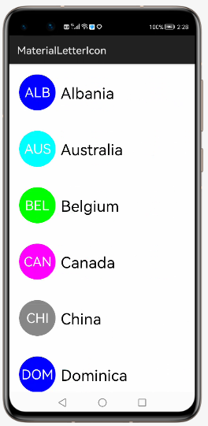
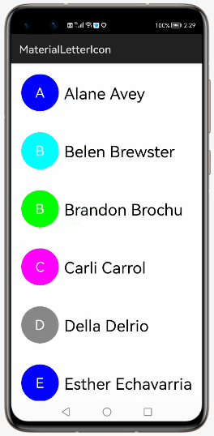

# MaterialLetterIcon
Material letter icon replicates contacts icon view with options for several shapes, backgrounds, fonts and sizes.


&nbsp;&nbsp;&nbsp;&nbsp;&nbsp;&nbsp;&nbsp;&nbsp;&nbsp;&nbsp;&nbsp;&nbsp;&nbsp;&nbsp;&nbsp;&nbsp;


## Source
The code in this repository was inspired from [IvBaranov/MaterialLetterIcon - Release 0.2.4](https://github.com/IvBaranov/MaterialLetterIcon). 
We are very thankful to Ivan Baranov. 

## Features
1. Shape Color: It can be used to change the color of the icon.
2. Shape Type: It can be used to change the shape of the icon.
3. Letter: It can be used to set the letters to be shown on the icon.
4. Letter Color: It can be used to set the color of the letters on the icon.
5. Letter Size: It can be used to set the size of letters on the icon.
6. Letters Number: It can be used to set the number of letters on the icon.
7. Letter Typeface: It can be used to set the font type of letters on the icon.
8. Initials: It can be used to extract `letters number` of letters of each word in `letter` to be shown on the icon.
9. Initials Number: It can be used to set the number of initials to be shown.

## Dependency
1. For using MaterialLetterIcon module in sample app, include the source code and add the below dependencies in entry/build.gradle to generate hap/support.har.
```
	dependencies {
		implementation project(':materiallettericon')
        	implementation fileTree(dir: 'libs', include: ['*.har'])
        	testCompile 'junit:junit:4.12'
	}
```
2. For using MaterialLetterIcon in separate application using har file, add the har file in the entry/libs folder and add the dependencies in entry/build.gradle file.
```
	dependencies {
		implementation fileTree(dir: 'libs', include: ['*.har'])
		testCompile 'junit:junit:4.12'
	}

```
## Usage
Declare in XML (see xml attributes below for customization):

```
<com.github.ivbaranov.mli.MaterialLetterIcon 
        ohos:id="$+id:icon"
        ohos:width="70vp"
        ohos:height="70vp"
        ohos:margin="10vp"
        app:mli_letters_number="3"
        />
```

Or static initializer (see xml attributes below for customization):

```
MaterialLetterIcon icon = new MaterialLetterIcon.Builder(context) 
            .shapeColor(Color.BLACK)
            .shapeType(SHAPE.CIRCLE)
            .letter("S")
            .letterColor(Color.BLACK)
            .letterSize(26)
            .lettersNumber(1)
            .letterTypeface(yourTypeface)
            .initials(false)
            .initialsNumber(2)
            .create();
```

Configure using xml attributes or setters in code:
```
app:mli_shape_color="#000000"           // shape color {#000000 - BLACK} 
app:mli_shape_type="0"                  // shape type index of { CIRCLE, RECT, ROUND_RECT, TRIANGLE }
app:mli_letter=""                       // letter, string or initials to get letters from
app:mli_letter_color="#FFFFFF"          // letter color {#FFFFFF - WHITE}
app:mli_letter_size="26"                // letter size SP
app:mli_letters_number="1"              // number of letters to get from `mli_letter`
app:mli_initials="false"                // turn on initials mode (takes `mli_letters_number` of letters of each word in `mli_letter`)
app:mli_initials_number="2"             // number of initials to be shown
```

Rectangular shape with rounded corners code:
```
MaterialLetterIcon icon = new MaterialLetterIcon.Builder(context) 
            .shapeColor(Color.BLUE)
            .shapeType(SHAPE.ROUND_RECT)
            .roundRectRx(8) // default x-corner radius
            .roundRectRy(8) // default x-corner radius
```
## License
Copyright 2015 Ivan Baranov

Licensed under the Apache License, Version 2.0 (the "License");
you may not use this file except in compliance with the License.
You may obtain a copy of the License at

   http://www.apache.org/licenses/LICENSE-2.0

Unless required by applicable law or agreed to in writing, software
distributed under the License is distributed on an "AS IS" BASIS,
WITHOUT WARRANTIES OR CONDITIONS OF ANY KIND, either express or implied.
See the License for the specific language governing permissions and
limitations under the License.
